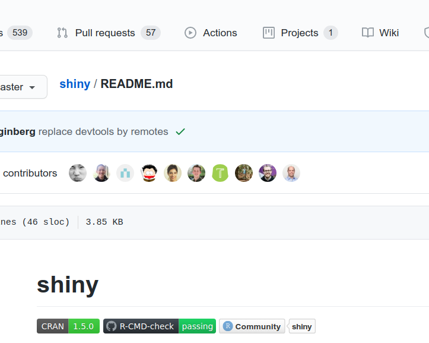

# Interactive Analytics with Shiny

# Testing
# 

<!-- badges: start -->
<!-- badges: end -->

Shiny is a package from RStudio that makes it possible to build interactive web applications with R.
For a more detailed tutorial, visit my [Homepage](http://schroederjan.com/) [BLOGPOST COMING SOON].

## Features

* Build useful web applications with only a few lines of code&mdash;no JavaScript required.

## Installation

To install the stable version from CRAN, simply run the following from an R console:

```r
install.packages("shiny")
```

To install the latest development builds directly from GitHub, run this instead:

```r
if (!require("remotes"))
  install.packages("remotes")
remotes::install_github("rstudio/shiny")
```

## The Shiny Universe

To learn more I recommend you check out the [Shiny Tutorial](http://shiny.rstudio.com/tutorial/). The tutorial explains the framework in-depth, walks you through building a simple application, and includes extensive annotated examples.
