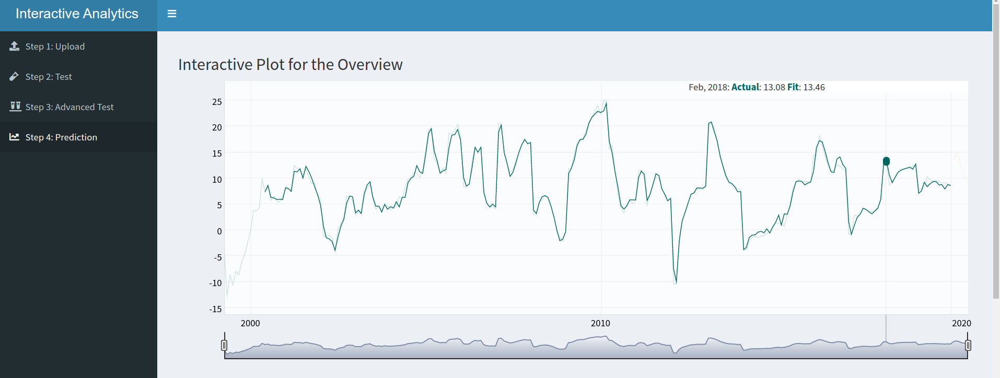
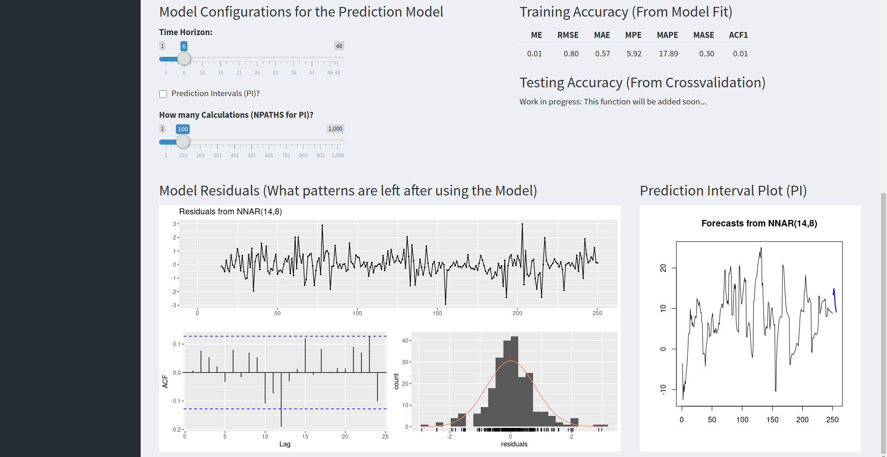

# Interactive Analytics with Shiny
> Want a quick, professional and interactive way of predicting some time series data without needing to code? Look no further! This is supposed to be a go to template for interactive advanced analytics for time series data.

## Table of contents
* [Introduction](#introduction)
* [Background](#background)
* [Dependencies](#dependencies)
* [Local Setup](#local-setup)
* [Docker Setup](#docker-setup)
* [Features](#features)
* [Status](#status)
* [Inspiration](#inspiration)
* [Contact](#contact)

## Introduction
This project contains a ready to go shiny web application for interactive quick advanced predictive data analytics. Shiny is a package from RStudio that makes it possible to build interactive web applications with R.
Especially for departments without the necessary R skills to engage in advanced analytics, Shiny templates can help to bring data analytics to the next level. Although KNIME, Alteryx, and other low-code solutions are very helpful to fill the knowledge gap in more business-centered teams, those tools still lack the ease of traditional web applications. With my Shiny template, a team can make use of advanced analytics without being afraid of breaking anything. Whether you want to run the app locally or on a server, to access it through your company network, both bring your team from descriptive to predictive analytics fast.

For a more detailed tutorial of how to use this applicaion in praxis, visit my [Website](http://schroederjan.com/). `(COMING SOON)`

## Background
Whenever I work with colleagues from the finance or logistics department, I find one problem. They have the data, they have the business knowledge, but what they do not have, is enough time to learn how to build data analytics applications or wait for IT Resources being available. This way, tremendous insight stays hidden inside spreadsheets or databases. And even if you have a full-fledged data science department at your disposal. Quick web applications are the next step in the evolution of business intelligence and reports. Communication is key and nothing communicates better than interactivity in complex scenario planning. 




What I would like to achieve here is to provide a simple and easy way for non-code experts to use advanced algorithms and bring their department from descriptive to predictive analytics. A step on most companies roadmap, they are still struggling to reach.

## Dependencies
For the project to work, you need R, Rstudio, knowledge of Shiny (to get the app running locally), and all required packages installed.

* [R & RStudio](https://rstudio.com)

All R versions should be fine. I was using the stable version 3.6.3, though.
If you need more help with R and RStudio, you can find detailed instructions [here](https://rstudio.com/products/rstudio/download/#download)

* [Shiny](http://shiny.rstudio.com/tutorial/)

If you have never programmed a Shiny app before, I recommend you to check out the [Shiny Tutorial](http://shiny.rstudio.com/tutorial/). It explains the framework in-depth, walks you through building a simple application, and includes extensive annotated examples.
NOTE: I am using the new Shiny (>1.5.0) and apply the `moduleServer` instead of the `callModule` function.

* R Packages

In my experience, there should be no big problem with different versions of R packages in this project. Just install the packages written in the [packages.R](https://github.com/AionosChina/interactive-shiny-analytics/blob/main/modules/packages.R) file manually like usual:
```r
install.packages("PACKAGE_NAME")
```
If there are some issues, you can have a look at my session information below.
```r
sessionInfo()

# R version 3.6.3 (2020-02-29)
# Platform: x86_64-pc-linux-gnu (64-bit)
# Running under: Ubuntu 20.04.1 LTS

#other attached packages:
# readr_1.4.0
# glue_1.4.2
# shinydashboard_0.7.1
# xts_0.12.1
# lubridate_1.7.9
# tibbletime_0.1.6
# rlang_0.4.8
# purrr_0.3.4
# tibble_3.0.4
# timetk_2.4.0        
# forecast_8.13
# zoo_1.8-8 
# dplyr_1.0.2 
# dygraphs_1.1.1.6  
# shiny_1.5.0         
```
## Local Setup
 1. First, clone the repository to your local machine into any location.
 
```bash
git clone https://github.com/AionosChina/interactive-shiny-analytics.git
```

2. Then, go into the new folder and open the project file `interactive-shiny-analytics.Rproj` with RStudio.

```bash
├── app.R
├── data
│   └── Chinese_House_Prices_Monthly.csv
├── interactive-shiny-analytics.Rproj
├── man
│   └── screenshots
│       ├── app_01.png
│       └── app_02.png
├── module-example
│   ├── app.R
│   ├── downloadModule.R
│   ├── storms.csv
│   └── uploadModule.R
├── modules
│   ├── crossvalidationModule.R
│   ├── downloadModule.R
│   ├── packages.R
│   ├── predictModule.R
│   └── uploadModule.R
├── README.html
├── README.md
```

3. When all dependencies are met, you can open the file `app.R` and click `Run App` in RStudio.
The application should run locally on your computer and open automatically.

## Docker Setup
`(COMING SOON)`

## Features:
* Upload your own time-series data as a .csv file
* Upload and add external regressors (errors) to your input data `(COMING SOON)`
* Test your time series data with basic statistical tests
* Use advanced statistical tests for your algorithms such as cross-validation `(COMING SOON)`
* Predict your time series data and check the model based on residuals
* Download a full report of your findings `(COMING SOON)`

## Algorithms:
* Neural Network Autoregression (NNAR)
* Auto-ARIMA `(COMING SOON)`
* Long Short-Term Memory Neural Network (LSTM) `(COMING SOON)`

## Status
The project is _in progress_ and will be expanded with new features soon.
My goal is it to build a state of the art "Prediction Tool" application template that anyone can customize or expand at will.

### To-do list:
* Docker Image Setup
* Live Usecase on AWS

## Inspiration
If you like to learn more about R, Shiny or Predictive Analytics, you can check out these links below.

* [Business Science University](https://university.business-science.io/)
* [Rob J Hyndman](https://robjhyndman.com/publications/)

## Contact
Created by [Jan Schroeder](https://www.schroederjan.com/) - feel free to contact me!

